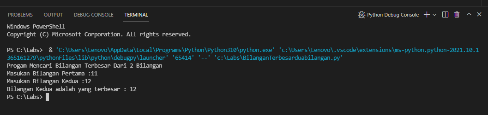
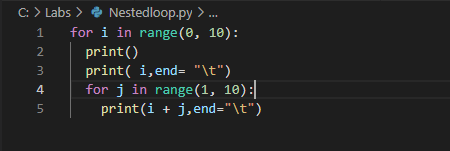

# latihan3-modul
## Membuat Progam Sederhana dengan Menentukan Bilangan Terbesar Dari Dua Bilangan

#### Untuk membuat progam tersebut menggunakan statement if seperti gambar dibawah ini.
           
fungsi print() digunakan untuk mencetak output program dilayar. Fungsi if dan else untuk mengeksekusi kode jika kondisi bernilai benar True. Fungsi a>b untuk pembanding angka yang lebih besar dari dua bilangan tersebut. Gambar dibawah ini adalah hasil running dari progam yang sudah dibuat.                                                     

## Membuat Program Dengan Mengurutkan Data Bilangan Dari Data Terkecil.

#### Untuk membuat progam tersebut gunakan perintah seperti gambar dibawah ini.
           
pada perintah for i in range() berfungsi untuk mengembalikan nilai berupa objek deret angka secara berurut sesuai dengan sintaks yang ditentukan, disini saya menggunakan range(7) yang berarti perulangan secara berurut dari 1 sampai 7. Pada perintah list.sort() berfungsi untuk mengurutkan data asli. Progam ini dibuat untuk mengurutkan bilangan dimulai dari yang terkecil ke terbesar yang sebelumnya bilangan tersebut belum berurut. Dibawah ini merupakan gambar hasil progam.                                                       

## Membuat Progam Perulangan Bertingkat NestedLoop

#### Menggunakan perintah seperti gambar dibawah ini.
           
fungsi \t untuk menulis karakter tab, dan menggunakan perintah for loop untuk mengulangi item dari urutan apapun,seperti list atau string. Dibawah ini adalah gambal dari hasil menggunakan perintah for loop.

## Bilangan Acak Lebih Kecil Dari 0,5 

#### Pada pembuatan progam ini menggunakan perintah kombinasi antara While dan For.

#### Dibawah ini adalah gambar hasil pemograman dengan menggunakan kombinasi while dam for
           
Pada gambar tesrsebut saya memasukan nilai 3 yang berati perulangan akan muncul sebanyak 3 kali.

## Membuat Progam Sederhana Dengan Menetukan Bilangan Terbesar Dari Tiga Bilangan.

#### Membuat Flowchacrt
           
Dengan memasukan 3 angka akan membandingkan ketiga bilangan tersebut untuk menghasilkan bilangan yang terbesar dari ketiga bilangan tersebut.
#### Berikut adalah Code Pemograman Menggunakan Statement if 
      
Untuk variabel a,b,dan c adalah permisalan untuk bilangan pertama, kedua maupun ketiga.
#### Beriku adalah hasil adri program pada saat dijalankan

## Latihan 1
## Membuat Bilangan Acak Lebih Kecil Dari 0,5

#### Penjelasan Alur Program
1. fungsi for random import random adalah menghasilkan angka yang memiliki tipe data float dan berada pada rentang 0,0 hingga 1,0.
2. fungsi n = int(input("Masukan Jumlah n :")) adalah perintah untuk menginput nilai n tersebut.
3. fungsi while n==n: adalah untuk nengeksekusi perulangan tanpa henti.
4. fungsi break adalah untuk menghentikan perulangan while.
5. fungsi for i in range(n): adalah untuk mengembalikan nilai berupa objek deret angka secara berurut sesuai dengan sintaks yang ditentukan.
6. fungsi bil = random()%0.5 adalah untuk merandom bilangan rill.
7. fungsi print("Data Ke", i+1, "=", bil) adalah perintah untuk menampilkan hasil yang telah diinput.
#### Berikut adalah code dari penjelasan alur program di atas

#### Berikut adalah hasil progam setelah dijalankan

## Latihan 2

## Membuat Program Untuk Menampilkann Bilangan Terbesar Dari n Buah Data Yang Diinputkan

#### Berikut adalah penjelasan alur program
1. fungsi print("Menampilkan bilangan terbesar dari n buah data yang diinput") adalah untuk perintah menampilkan judul program.
2. fungsi max = 0 adalah untuk menampilkan nilai max yaitu 0.
3. fungsi while True: adalah untuk pengulangan tanpa henti.
4. a = int(input("Masukan Bilangan:")) adalah untuk menginput nilai.
5. if max < a: untuk tipe data if, maksimal nilai lebih kecil adari a.
6. max = a untuk nilai maksimal sama dengan a.
7. fungsi if a==0 untuk tipe data a sama dengan 0.
8. fungsi break untuk menghentikan atau mengakhiri pengulangan.
9. print("Bilangan Terbesar Adalah:",max) untuk menampilkan hasil bilangan yang terbesar dari data yang telah diinput.
#### Berikut adalah code dari penjelasan alur program

#### Berikut adalah gambaran progam setelah dijalankan

## Menghitung Laba

#### Berikut adalah Penjelasan Alur Program
1. fungsi print("Laba Investasi") untuk menampilkan judul.
2. fungsi x =int(input("Uang Modal Awal :")) untuk menginput nilai x sebagai modal awal.
3. fungsi a = 0*x merupakan bulan pertama yang berati pada bulan ini belum memiliki laba, dan untuk x itu sendiri adalah niali uang modal pertama.
4. fungsi b = 0*x merupakan bulan kedua yang berati pada bulan ini belum memiliki laba.
5. fungsi c = 0.01*x merupakan bulan ketiga dimana pada bulan ini sudah memiliki laba yaitu 1% jika di desimalkan berati 0.01 dikali dengan x yaitu nilai uang modal awal.
6. fungsi d = 0.01*x merupakan bulan keempat dimana pada bulan ini sudah memiliki laba 1%.
7. fungsi e = 0.05*x merupakan bulan kelima dimana pada bulan ini sudah memiliki laba yaitu 5% jika di desimalkan berati menjadi 0.05.
8. fungsi f = 0.05*x merupakan bulan keenam dimana pada bulan ini sudah memiliki laba sebesar 5%.
9. fungsi g = 0.05*x merupakan bulan ketujuh dimana pada bulan ini sudah memiliki laba sebesar 5%.
10. fungsi h = 0.02*x merupakan bulan kedelapan dimana pada bulan ini sudah memiliki laba sebesar 2%.
11. fungsi y=[a,b,c,d,e,f,g,h] untuk menentukan syarat y yang berisi a,b,c,d,e,f,g,h.
12. fungsi for i in range(len(y)): untuk perulangan data dengan isi data y, dengan menampilkan urutan laba perbulan sesuai range yang ditentukan.
13. fungsi print("Laba Bulan Ke",i+1,"sebesar : ",y[i]) untuk menampilkan hasil laba dari bulan pertama hingga bulan terakhir.
14. fungsi z=(a+b+c+d+e+f+g+h) untuk z itu sendiri adalah data yang berisi hasil penjumlahan laba dimulai bulan pertama hingga bulan terakhir.
15. fungsi print("Jumlah Laba Selama 8 Bulan: ",z) untuk menampilkan hasil dar penjumlahan laba.
#### Berikut adalah code pemograman dari penjelasan alur program

#### Berikut adalah gambar setelah progam dijalankan 
